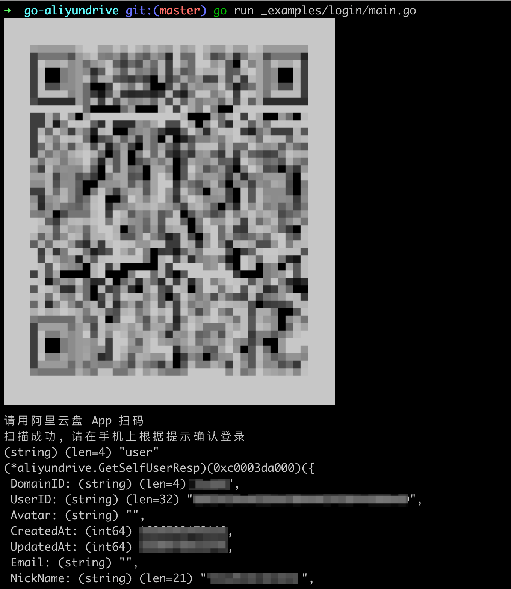
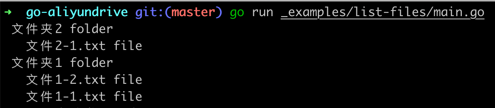
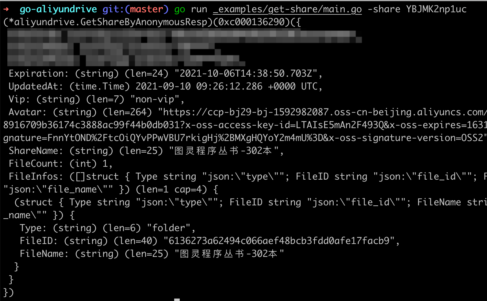

# go-aliyundrive

> 阿里云盘 Go SDK

## 广告位

- 阿里云盘 webdav 版: https://github.com/chyroc/aliyundrive-webdav

## 安装

```shell
go get github.com/chyroc/go-aliyundrive
```

## 使用

### 初始化 SDK 实例

```go
ins := aliyundrive.New()

// 下面所有提到的 ins 都是指这个实例
```

### 登录

> [具体代码参考这里](./_examples/login-by-qrcode/main.go)


```go
user, err := ins.Auth.LoginByQrcode(context.TODO())
```



### 读取文件

> [具体代码参考这里](./_examples/list-files/main.go)

```go
resp, err := ins.File.GetFileList(context.TODO(), &aliyundrive.GetFileListReq{
    DriveID:      driveID,
    ParentFileID: parentID,
    Marker:       next,
})
```



### 获取分享的内容

> [具体代码参考这里](./_examples/get-share/main.go)

```go
sharedInfo, err := ins.ShareLink.GetShareByAnonymous(ctx, &aliyundrive.GetShareByAnonymousReq{
    ShareID: shareID,
})
```


